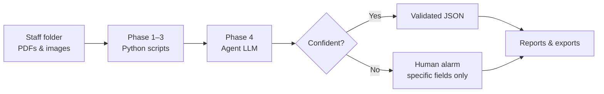

# Supplier Doc Intelligence

[](LICENSE)
[](https://github.com/agentskills/agentskills)

Open-source [Agent Skill](https://github.com/agentskills/agentskills) for **autonomous supplier document extraction** — batch CoQ, SDF, BSE/TSE, packaging specs, scans → structured JSON, with agent semantic review and human escalation only as a last resort.

Works with **Codex**, **Cursor**, **GitHub Copilot**, **Claude Code**, and other agents that load `SKILL.md`.

**Repository:** [github.com/jackyissocute/supplier-doc-intelligence](https://github.com/jackyissocute/supplier-doc-intelligence)

---

## What it does

Staff drop incoming supplier documents (CoQ, SDF, BSE/TSE, packaging specs, scans) into a folder. An agent loads this skill and runs a **5-phase pipeline**:

1. **Ingest** — scan files, create workspace  
2. **Extract** — multi-engine OCR + Tier 1 crop re-OCR + Tier 2 layout fields  
3. **Mechanical QA** — fill-rate and confidence gates  
4. **Semantic review** — agent reads context, fixes obvious errors (e.g. µg vs mg, lot `I` vs `1`)  
5. **Deliver** — validated JSON + report; human alarm only for true ambiguity  

**Design goal:** fully autonomous documenting — not a human-in-the-loop workbench.

---

## Workflow at a glance

### Five phases (linear pipeline)

```
  ┌─────────────┐    ┌─────────────────────────────┐    ┌─────────────┐    ┌─────────────┐    ┌─────────────┐
  │  1 INGEST   │───▶│       2 EXTRACT             │───▶│ 3 MECH QA   │───▶│ 4 SEMANTIC  │───▶│  5 DELIVER  │
  │   scripts   │    │ Tier1 crop OCR + Tier2 layout│    │   scripts   │    │    agent    │    │ agent+files │
  └─────────────┘    └─────────────────────────────┘    └─────────────┘    └─────────────┘    └─────────────┘
        │                         │                            │                  │                  │
   inventory.json           02_extracted/              mechanical_qa.json    review.json      04_validated/
                                                                                              05_escalated/
                                                                                              07_reports/
```

### Phase 2 detail (mechanical extraction)

```
  PDF / image
       │
       ▼
  ┌──────────────┐     ┌──────────────┐     ┌──────────────┐
  │ Multi-engine │────▶│  Tier 2      │────▶│  Tier 1      │
  │ OCR ensemble │     │ layout fields│     │ crop re-OCR  │
  └──────────────┘     └──────────────┘     └──────────────┘
       digital PDF          all docs           scans / low-conf
```

| Batch type | Command |
|------------|---------|
| Mixed / default | `run_extract.py … -r --no-gemini` |
| Scans & handwriting | `run_extract.py … -r --scan-mode --no-gemini` |

### Who does what



| Phase | Runs on | Accepts errors in round 1? |
|-------|---------|----------------------------|
| 1–3 Mechanical | Python / OCR scripts | **Yes** — handwriting & OCR noise expected |
| 4 Semantic | Agent (LLM) | Fixes with evidence from document text |
| 5 Deliver | Agent + scripts | Escalates only blocking ambiguity |

### Internal modes (one skill, not four installs)

| Mode | Typical user request |
|------|---------------------|
| **full-batch** | “Document this folder” |
| **extract-only** | “Extract fields from these PDFs” |
| **semantic-pass** | “Review extractions / fix OCR mistakes” |
| **report-only** | “Summarize what passed vs failed” |

The agent picks the mode from intent. Details in [`SKILL.md`](skills/supplier-doc-intelligence/SKILL.md).

---

## Workspace output (every job)

Each run creates an auditable workspace:

| Folder | Contents |
|--------|----------|
| `00_manifest/` | File inventory, mechanical QA, job metadata |
| `02_extracted/` | Raw OCR JSON (round 1 may include errors) |
| `03_semantic_review/` | Agent review bundles, `review.json`, `revised.json` |
| `04_validated/` | Documents that passed autonomously |
| `05_escalated/` | Human alarm — `human_review_request.json` |
| `06_exports/` | Final JSON for downstream systems |
| `07_reports/` | Job summary + agent self-assessment |
| `logs/` | `agent.log`, `reflection.jsonl` |

---

## Techniques

### Orchestration (this skill)

| Technique | Purpose |
|-----------|---------|
| **Progressive disclosure** | Triggers in `description`; details in `references/` loaded on demand |
| **Folder-staged pipeline** | Every phase leaves artifacts for audit and resume |
| **Agent semantic review** | Common-sense correction with evidence + confidence ≥ 0.85 |
| **Minimal human-in-the-loop** | Staff confirm only blocking fields, not every OCR box |
| **Self-reflection** | Agent logs accuracy improvement vs mechanical-only baseline |

### Mechanical extraction (via `SUPPLIER_DOC_ENGINE_ROOT` engine)

| Tier | Technique | Best for |
|------|-----------|----------|
| **Tier 1** | Page mode detection (`digital` / `scanned` / `mixed`) | Routing OCR strategy |
| **Tier 1** | Per-field crop re-OCR at 300 DPI | **Scanned PDFs, handwriting, low-confidence fields** |
| **Tier 1** | `--scan-mode` preset (Tier 1 + PaddleOCR) | Scan-heavy batches |
| **Tier 2** | Layout-aware label→value linking | Structured pharma forms |
| **Tier 2** | Confidence calibration | Per-field scoring |
| **Tier 2** | Doc-type refiners (CoQ, PKG, BSE) | Domain-specific cleanup |
| All | Multi-engine OCR ensemble | Native PDF + Tesseract + optional PaddleOCR |
| All | Optional Gemini vision | Cross-validate disputed fields |

The skill is **tool-agnostic** — any engine producing compatible JSON works. See [`references/mechanical-extraction.md`](skills/supplier-doc-intelligence/references/mechanical-extraction.md).

---

## Install

```bash
git clone https://github.com/jackyissocute/supplier-doc-intelligence.git
cd supplier-doc-intelligence
```

Copy the skill folder into your agent skills directory:

| Platform | Path |
|----------|------|
| Codex / generic agents | `~/.agents/skills/supplier-doc-intelligence` |
| Cursor (project) | `.cursor/skills/supplier-doc-intelligence` |
| Claude Code | `~/.claude/skills/supplier-doc-intelligence` |

```bash
cp -R skills/supplier-doc-intelligence ~/.agents/skills/
```

### Prerequisites

```bash
cd skills/supplier-doc-intelligence   # or your installed copy
bash scripts/setup_environment.sh --install-deps   # tesseract + pip deps (first time)
export SUPPLIER_DOC_ENGINE_ROOT=/path/to/your/extraction-engine
bash scripts/check_prerequisites.sh
```

Optional: `GEMINI_API_KEY` for vision retry · `PHARMADOC_USE_PADDLE=1` or `--scan-mode` for scan-heavy batches · `PHARMADOC_TIER1=1` (default on)

**Note:** Tesseract installs once per machine via `setup_environment.sh --install-deps` — not on every document job.

---

## Usage

### With an agent (recommended)

```
Use supplier-doc-intelligence to document ~/incoming/sdf-june
into ~/doc-runs/sdf-june-21. Fix obvious OCR errors from context;
only ask me if a required field is truly ambiguous.
```

For scan-heavy folders, add: “use scan mode for Phase 2.”

### Mechanical phases (scripts)

```bash
SKILL=skills/supplier-doc-intelligence
export SUPPLIER_DOC_ENGINE_ROOT=/path/to/extraction-engine

# Default (Tier 1 on)
python3 $SKILL/scripts/orchestrate_job.py \
  ~/incoming/sdf-june \
  ~/doc-runs/sdf-june-21 \
  --recursive --no-gemini

# Scans / handwriting
python3 $SKILL/scripts/orchestrate_job.py \
  ~/incoming/scanned-coq \
  ~/doc-runs/coq-scan \
  --recursive --scan-mode --no-gemini
```

Then the agent completes **Phase 4** (semantic review) on each `review_bundle.json` under `03_semantic_review/`.

More examples: [`examples/example-prompts.md`](examples/example-prompts.md)

---

## Repository layout

```
supplier-doc-intelligence/
├── README.md                          ← you are here
├── LICENSE
├── examples/
│   └── example-prompts.md
└── skills/
    └── supplier-doc-intelligence/   ← install this folder
        ├── SKILL.md                   ← agent playbook
        ├── scripts/                   ← deterministic tools
        ├── references/                ← loaded on demand
        └── assets/                    ← report templates
```

**For agents:** read `skills/supplier-doc-intelligence/SKILL.md`  
**For humans:** this README + workflow tables above

---

## Quality gates

| Layer | Checks |
|-------|--------|
| **Mechanical** | Field fill rate ≥ 80% · low-confidence fields ≤ 3 · text present on page |
| **Semantic** | No human escalation flag · required fields resolved · patch confidence ≥ 0.85 |

Mechanical failure does **not** stop the batch — semantic review may recover from `full_text`.

Full definitions: [`references/quality-gates.md`](skills/supplier-doc-intelligence/references/quality-gates.md)

---

## Safety

- Review scripts before enabling shell auto-approval in your agent client.
- Agent semantic revisions require evidence in `review.json` — no silent edits.
- Source files in the user's original folder are never deleted.
- Human staff are notified only via `05_escalated/human_review_request.json`.

---

## Accuracy roadmap

| Tier | Status | Impact |
|------|--------|--------|
| **Tier 2** (layout, calibration, doc-type refiners) | **Shipped** | Better fields on structured pharma forms |
| **Tier 1** (page mode, per-field crop re-OCR, scan preset) | **Shipped** | Best for **scanned** PDFs and handwriting |
| **Tier 0** (larger eval corpus, table extraction) | Planned | Benchmark expansion + table-heavy forms |

Tier 1 runs automatically in Phase 2 (`PHARMADOC_TIER1=1`). Use `--scan-mode` for scan-heavy batches; agent phases 3–5 are unchanged.

## License

MIT — see [LICENSE](LICENSE).
