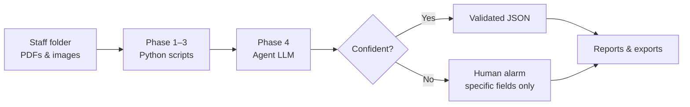

# Supplier Doc Intelligence

[](LICENSE)
[](https://github.com/agentskills/agentskills)

**Autonomous supplier document extraction for AI agents** — batch CoQ, SDF, BSE/TSE, packaging specs, and scans → structured JSON, with semantic review and human escalation only as a last resort.

Works with **Cursor**, **Codex**, **Claude Code**, **GitHub Copilot**, and any client that loads [Agent Skills](https://github.com/agentskills/agentskills) (`SKILL.md`).

---

## Quick start (5 minutes)

### 1. Download

```bash
git clone https://github.com/jackyissocute/supplier-doc-intelligence.git
cd supplier-doc-intelligence
```

### 2. Install the skill for your agent

Copy **only** the skill folder (not the whole repo) into your agent’s skills directory:

| Platform | Install path |
|----------|--------------|
| **Cursor** (project) | `.cursor/skills/supplier-doc-intelligence` |
| **Cursor / Codex** (global) | `~/.cursor/skills/supplier-doc-intelligence` |
| **Codex / generic agents** | `~/.agents/skills/supplier-doc-intelligence` |
| **Claude Code** | `~/.claude/skills/supplier-doc-intelligence` |

```bash
# Example: global install for Codex-style agents
cp -R skills/supplier-doc-intelligence ~/.agents/skills/
```

Restart your agent or reload skills if your client requires it.

### 3. One-time machine setup

The skill **orchestrates** extraction; you also need the **OCR engine** (separate folder on your machine):

```bash
cd ~/.agents/skills/supplier-doc-intelligence   # or your install path

# Install Tesseract + Python deps (once per computer)
bash scripts/setup_environment.sh --install-deps

# Point at your extraction engine (directory with run_agent.sh)
export SUPPLIER_DOC_ENGINE_ROOT=/path/to/your/extraction-engine

# Verify everything
bash scripts/check_prerequisites.sh
```

Optional: `export GEMINI_API_KEY=...` for vision retry on hard fields.

Add `SUPPLIER_DOC_ENGINE_ROOT` to your shell profile if you use the skill often.

### 4. Run your first job

**Easiest — ask your agent:**

```
Use supplier-doc-intelligence to document ~/incoming/sdf-june
into ~/doc-runs/sdf-june-21. Fix obvious OCR errors from context;
only ask me if a required field is truly ambiguous.
```

**Or run mechanical phases yourself:**

```bash
SKILL=~/.agents/skills/supplier-doc-intelligence
export SUPPLIER_DOC_ENGINE_ROOT=/path/to/your/extraction-engine

python3 "$SKILL/scripts/orchestrate_job.py" \
  ~/incoming/sdf-june \
  ~/doc-runs/sdf-june-21 \
  --recursive --no-gemini
```

Then let the agent finish **Phase 4** (semantic review) on each `03_semantic_review/*/review_bundle.json`.

**Scan-heavy folder?** Add `--scan-mode` or tell the agent: *“use scan mode for Phase 2.”*

More prompts: [`examples/example-prompts.md`](examples/example-prompts.md)

---

## What this skill does

Staff drop incoming supplier documents into a folder. The agent loads this skill and runs a **5-phase pipeline**:

| Phase | Who | What happens |
|-------|-----|--------------|
| **1 Ingest** | Scripts | Scan PDFs/images, write inventory |
| **2 Extract** | Scripts + OCR engine | Multi-engine OCR, Tier 1 crop re-OCR, Tier 2 layout fields |
| **3 Mechanical QA** | Scripts | Fill-rate and confidence gates |
| **4 Semantic review** | **Agent (LLM)** | Read context, fix obvious errors (µg vs mg, lot `I` vs `1`) |
| **5 Deliver** | Agent + scripts | Validated JSON + report; human alarm only for true ambiguity |

**Design goal:** fully autonomous documenting — not a human-in-the-loop workbench.

```
  INGEST ──▶ EXTRACT ──▶ MECH QA ──▶ SEMANTIC REVIEW ──▶ DELIVER
  scripts     OCR engine   scripts      agent (you)       validated JSON
```

Round 1 **allows OCR noise** (handwriting, scans). The agent recovers in Phase 4 instead of stopping the batch.

### Document types supported

- Certificates of Quality (CoQ)
- Supplier data forms (SDF)
- BSE/TSE declarations
- Packaging specifications
- Scanned PDFs and images (PNG, JPG, TIFF)
- Mixed digital + scan batches

### Modes (one skill — agent picks from your words)

| You say | Mode | Phases |
|---------|------|--------|
| “Document this folder” | **full-batch** | 1 → 5 |
| “Extract fields from these PDFs” | **extract-only** | 1 → 3 |
| “Review extractions / fix OCR mistakes” | **semantic-pass** | 4 → 5 |
| “What passed vs failed?” | **report-only** | 5 |

---

## What's inside the skill

This repo ships one installable skill folder. **Agents read `SKILL.md`; humans read this README.**

```
skills/supplier-doc-intelligence/
├── SKILL.md                 ← Agent playbook (phases, commands, rules)
├── scripts/                 ← Deterministic tools the agent runs
│   ├── orchestrate_job.py   ← Phases 1–3 + prepare semantic bundles
│   ├── run_extract.py       ← Phase 2 extraction (Tier 1 + Tier 2)
│   ├── scan_folder.py       ← Inventory PDFs and images
│   ├── evaluate_gates.py      ← Mechanical QA gates
│   ├── prepare_semantic_review.py
│   ├── apply_semantic_patch.py
│   ├── setup_environment.sh ← First-time deps (Tesseract, pip)
│   └── check_prerequisites.sh
├── references/              ← Loaded by agent on demand
│   ├── workflow.md          ← Full batch checklist
│   ├── semantic-review.md   ← Phase 4 decision rules
│   ├── mechanical-extraction.md
│   ├── quality-gates.md
│   └── tooling.md           ← Engine setup
└── assets/                  ← Report templates
    ├── job-report-template.md
    └── self-assessment-template.md
```

**Skill vs engine:** This package is the **orchestration layer** (workspace staging, QA, semantic review workflow). Phase 2 calls an external **extraction engine** via `SUPPLIER_DOC_ENGINE_ROOT` (reference implementation: PharmaDoc AutoPipeline). Any engine that outputs compatible JSON works.

---

## How to use (by platform)

### Cursor

1. Copy skill to `.cursor/skills/supplier-doc-intelligence` (project) or `~/.cursor/skills/` (global).
2. Set `SUPPLIER_DOC_ENGINE_ROOT` in your environment or project `.env`.
3. In chat: *“Use supplier-doc-intelligence to document …”*

The agent discovers the skill from its `description`, loads `SKILL.md`, and runs the scripts.

### Codex / Claude Code / other Agent Skills clients

1. Install to `~/.agents/skills/` or `~/.claude/skills/`.
2. Run setup once (see [Quick start](#quick-start-5-minutes)).
3. Invoke by name: **`supplier-doc-intelligence`**

### Without an agent (scripts only)

```bash
SKILL=~/.agents/skills/supplier-doc-intelligence
export SUPPLIER_DOC_ENGINE_ROOT=/path/to/extraction-engine

# Full mechanical run (Phases 1–3 + semantic bundles)
python3 "$SKILL/scripts/orchestrate_job.py" <SOURCE> <WORKSPACE> -r --no-gemini

# Scans / handwriting
python3 "$SKILL/scripts/orchestrate_job.py" <SOURCE> <WORKSPACE> -r --scan-mode --no-gemini

# Extract only
python3 "$SKILL/scripts/run_extract.py" <SOURCE> <WORKSPACE> -r --no-gemini
```

Phase 4 (semantic review) is designed for an LLM agent — see [`SKILL.md`](skills/supplier-doc-intelligence/SKILL.md).

---

## Workflow at a glance

### Who does what



| Phase | Runs on | Accepts errors in round 1? |
|-------|---------|----------------------------|
| 1–3 Mechanical | Python / OCR scripts | **Yes** — handwriting & OCR noise expected |
| 4 Semantic | Agent (LLM) | Fixes with evidence from document text |
| 5 Deliver | Agent + scripts | Escalates only blocking ambiguity |

### Phase 2 extraction stack

```
  PDF / image → Multi-engine OCR → Tier 2 layout fields → Tier 1 crop re-OCR → JSON
                  digital PDF         all docs              scans / low-conf
```

| Batch type | Flag |
|------------|------|
| Mixed / default | `--no-gemini` (Tier 1 on by default) |
| Scans & handwriting | `--scan-mode` (Tier 1 + PaddleOCR) |

Details: [`references/mechanical-extraction.md`](skills/supplier-doc-intelligence/references/mechanical-extraction.md)

---

## Workspace output (every job)

Each run creates an auditable workspace:

| Folder | Contents |
|--------|----------|
| `00_manifest/` | File inventory, mechanical QA, job metadata |
| `02_extracted/` | Raw OCR JSON (round 1 may include errors) |
| `03_semantic_review/` | Agent review bundles, `review.json`, `revised.json` |
| `04_validated/` | Documents that passed autonomously |
| `05_escalated/` | Human alarm — `human_review_request.json` |
| `06_exports/` | Final JSON for downstream systems |
| `07_reports/` | Job summary + agent self-assessment |
| `logs/` | `agent.log`, `reflection.jsonl` |

---

## Capabilities

### Orchestration (this skill)

| Technique | Purpose |
|-----------|---------|
| Progressive disclosure | Triggers in `description`; details in `references/` |
| Folder-staged pipeline | Every phase leaves artifacts for audit and resume |
| Agent semantic review | Common-sense correction with evidence + confidence ≥ 0.85 |
| Minimal human-in-the-loop | Staff confirm only blocking fields |
| Self-reflection | Agent logs accuracy vs mechanical-only baseline |

### Mechanical extraction (via engine)

| Tier | Technique | Best for |
|------|-----------|----------|
| **Tier 1** | Page mode + per-field crop re-OCR | Scanned PDFs, handwriting |
| **Tier 1** | `--scan-mode` preset | Scan-heavy batches |
| **Tier 2** | Layout-aware label→value linking | Structured pharma forms |
| **Tier 2** | Doc-type refiners (CoQ, PKG, BSE) | Domain cleanup |
| All | Multi-engine OCR + optional Gemini | Digital and mixed batches |

---

## Environment variables

| Variable | Required | Purpose |
|----------|----------|---------|
| `SUPPLIER_DOC_SKILL_ROOT` | Auto-set by scripts | Path to installed skill folder |
| `SUPPLIER_DOC_ENGINE_ROOT` | **Yes** for Phase 2 | Path to extraction engine |
| `GEMINI_API_KEY` | No | Vision retry on disputed fields |
| `PHARMADOC_TIER1=1` | No (default on) | Per-field crop re-OCR (engine) |
| `PHARMADOC_USE_PADDLE=1` | No | Stronger OCR on scans |

Legacy aliases `PHARMADOC_ROOT` and `PHARMADOC_SKILL_ROOT` still work.

Full setup guide: [`references/tooling.md`](skills/supplier-doc-intelligence/references/tooling.md)

---

## Quality gates

| Layer | Checks |
|-------|--------|
| **Mechanical** | Field fill rate ≥ 80% · low-confidence fields ≤ 3 · text on page |
| **Semantic** | Required fields resolved · patch confidence ≥ 0.85 |

Mechanical failure does **not** stop the batch — semantic review may recover from `full_text`.

---

## Troubleshooting

| Problem | Fix |
|---------|-----|
| Agent doesn’t pick up the skill | Confirm folder name is `supplier-doc-intelligence` and contains `SKILL.md`; restart client |
| `SUPPLIER_DOC_ENGINE_ROOT` missing | Export path to engine; run `check_prerequisites.sh` |
| Tesseract not found | `bash scripts/setup_environment.sh --install-deps` |
| Poor results on scans | Re-run with `--scan-mode` or ask agent to use scan mode |
| Phase 2 works, no validated output | Phase 4 is agent-driven — run semantic review on `review_bundle.json` files |

---

## Safety

- Review scripts before enabling shell auto-approval in your agent client.
- Semantic revisions require evidence in `review.json` — no silent edits.
- Source files in the user's original folder are never deleted.
- Human staff are notified only via `05_escalated/human_review_request.json`.

---

## Roadmap

| Tier | Status | Impact |
|------|--------|--------|
| Tier 2 (layout, calibration, refiners) | **Shipped** | Structured pharma forms |
| Tier 1 (crop re-OCR, scan preset) | **Shipped** | Scans and handwriting |
| Tier 0 (larger eval, tables) | Planned | Table-heavy forms |

---

## Repository layout

```
supplier-doc-intelligence/          ← GitHub repo (this README)
├── README.md
├── LICENSE
├── examples/example-prompts.md
└── skills/
    └── supplier-doc-intelligence/  ← Copy this folder to install
        ├── SKILL.md                ← For agents
        ├── scripts/
        ├── references/
        └── assets/
```

**For agents:** `skills/supplier-doc-intelligence/SKILL.md`  
**For humans:** this README

---

## License

MIT — see [LICENSE](LICENSE).
