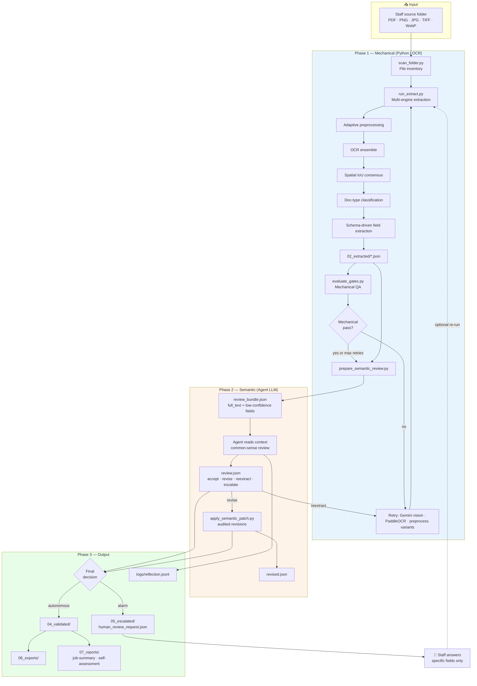
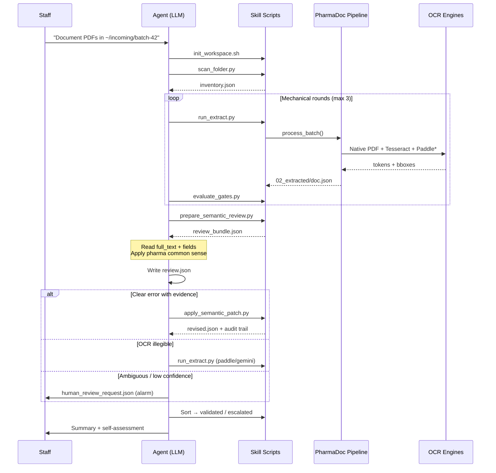
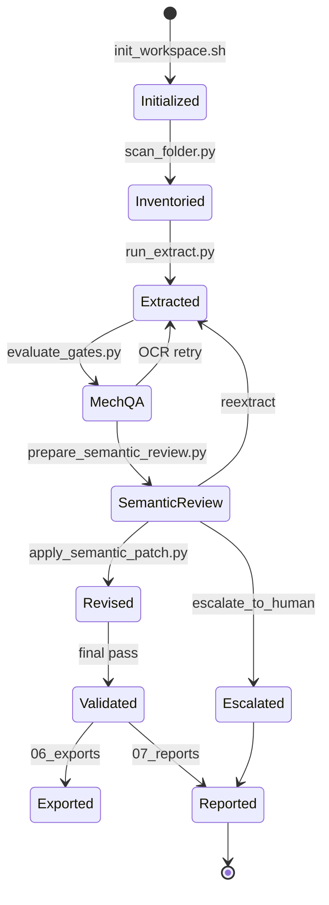
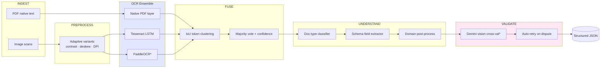
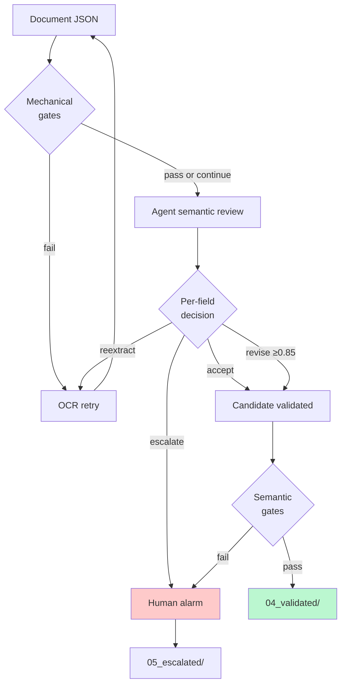

# PharmaDoc Document Intelligence — Agent Skill

[](LICENSE)

Open-source **Agent Skill** for autonomous healthcare/pharmaceutical document extraction — compatible with **Codex**, **Cursor**, **GitHub Copilot**, **Claude Code**, and other agents that load `SKILL.md` folders.

Portable [Agent Skills](https://github.com/openai/skills) package: scan PDFs/images → multi-engine OCR → **agent semantic review** → validated JSON output with human alarm only as last resort.

This README is the **architecture and workflow reference** — diagrams, techniques, and design rationale. Agents follow operational steps in [`skills/pharmadoc-document-intelligence/SKILL.md`](skills/pharmadoc-document-intelligence/SKILL.md).

---

## Table of contents

1. [Design philosophy](#design-philosophy)
2. [End-to-end workflow](#end-to-end-workflow)
3. [Three-layer intelligence model](#three-layer-intelligence-model)
4. [Workspace folder lifecycle](#workspace-folder-lifecycle)
5. [Techniques employed](#techniques-employed)
6. [Reference engine (PharmaDoc AutoPipeline)](#reference-engine-pharmadoc-autopipeline)
7. [Frontier & research alignment](#frontier--research-alignment)
8. [Quality gates](#quality-gates)
9. [Scripts & artifacts](#scripts--artifacts)
10. [Install & quick start](#install--quick-start)

---

## Design philosophy

Traditional document AI often fails in one of two ways:

| Approach | Problem |
|----------|---------|
| **Chat-only RAG** | Retrieves text but does not guarantee structured, auditable field extraction |
| **Human-in-the-loop workbench** | Accurate but does not scale for incoming supplier PDF/image batches |

This skill implements a **third path**:

```
Deterministic extraction (Python/OCR)  +  Agent semantic reasoning (LLM)  +  Human alarm (last resort)
```

- **Round 1 accepts OCR noise** — handwriting, mixed fonts, and scan artifacts are expected.
- **The agent reads like a staff reviewer** — common-sense checks (dose units, lot-number character confusion, date logic).
- **Every revision is audited** — `review.json`, evidence quotes, confidence scores.
- **Staff are pinged only for true ambiguity** — not for routine box correction.

---

## End-to-end workflow

### High-level pipeline



### Sequence view (one document)



### Round-based error tolerance

```
Round 1 (Extract)     ──►  Errors EXPECTED (handwriting, fonts, OCR noise)
         │
Round 2 (OCR retry)   ──►  Gemini vision · PaddleOCR · preprocess variants
         │
Round 3 (Semantic)    ──►  Agent context review · unit/date/lot logic
         │
Round 4 (Re-extract)  ──►  Agent-triggered if visual issue persists (max 2)
         │
Final                 ──►  Validated OR human alarm (not full manual QA)
```

---

## Three-layer intelligence model

```mermaid
graph LR
    subgraph L1["Layer 1 — Deterministic"]
        A1[Multi-engine OCR]
        A2[IoU consensus fusion]
        A3[Regex + schema fields]
        A4[Mechanical QA gates]
    end

    subgraph L2["Layer 2 — Agent cognitive"]
        B1[Full-text context reading]
        B2[Cross-field consistency]
        B3[Pharma common-sense rules]
        B4[Audited semantic patches]
        B5[Self-reflection log]
    end

    subgraph L3["Layer 3 — Human"]
        C1[Targeted field confirmation]
        C2[Handwriting authority judgment]
    end

    L1 --> L2
    L2 -->|confidence ≥ 0.85| OUT[Autonomous output]
    L2 -->|confidence < 0.85| L3
    L3 --> OUT

    style L1 fill:#dbeafe
    style L2 fill:#fed7aa
    style L3 fill:#fecaca
```



| Layer | Runs on | Strength | Weakness addressed by next layer |
|-------|---------|----------|----------------------------------|
| **Mechanical** | CPU/GPU scripts | Repeatable, fast, auditable JSON | OCR blind to meaning (µg vs mg) |
| **Semantic** | Agent LLM | Context, domain logic, handwriting interpretation | Needs evidence discipline |
| **Human** | Staff | Authoritative judgment on ambiguity | Does not scale — used sparingly |

---

## Workspace folder lifecycle

Each job creates a **staged workspace** — every step leaves artifacts for audit, expense reporting, and demo.

```
<workspace>/
│
├── 00_manifest/
│   ├── inventory.json              ← scanned file list
│   ├── mechanical_qa.json          ← fill rate, low-confidence counts
│   ├── semantic_qa.json            ← post-review gate results
│   └── semantic_review_pending.json← orchestrator handoff to agent
│
├── 01_ingest/                      ← optional source copies
│
├── 02_extracted/                   ← RAW mechanical JSON (round 1+)
│   └── coq-scan.json
│
├── 03_semantic_review/             ← AGENT cognitive layer
│   └── coq-scan/
│       ├── review_bundle.json      ← compact context for LLM
│       ├── review.json             ← agent decisions + evidence
│       └── revised.json            ← patched output + audit
│
├── 04_validated/                   ← autonomous pass
├── 05_escalated/                   ← human alarm only
│   └── coq-scan/
│       ├── coq-scan.json
│       ├── escalation.json
│       └── human_review_request.json
│
├── 06_exports/                     ← downstream JSON/CSV
├── 07_reports/
│   ├── job-summary.md
│   └── self-assessment.md          ← accuracy reflection
│
└── logs/
    ├── agent.log                   ← step-by-step actions
    └── reflection.jsonl            ← agent self-monitoring
```



---

## Techniques employed

### Skill orchestration layer

| Technique | Description | Where |
|-----------|-------------|-------|
| **Agent Skills spec** | Portable `SKILL.md` + scripts + references; trigger via description keywords | This repo |
| **Folder-staged pipeline** | Immutable stage folders mimic GxP-friendly document flow | `init_workspace.sh` |
| **Orchestrator / worker split** | Agent decides; scripts execute deterministically | `SKILL.md` workflow |
| **Semantic review protocol** | accept · revise · reextract · escalate per field | `references/semantic-review.md` |
| **Audited semantic patches** | Every LLM correction requires evidence + confidence ≥ 0.85 | `apply_semantic_patch.py` |
| **Human-in-the-loop alarm** | Staff engaged only for blocking ambiguity | `human_review_request.json` |
| **Agent self-reflection** | Post-job accuracy assessment in `reflection.jsonl` | `assets/self-assessment-template.md` |

### Mechanical extraction layer (PharmaDoc reference engine)

| Technique | Description | Module |
|-----------|-------------|--------|
| **Multi-engine OCR ensemble** | Native PDF text + Tesseract + optional PaddleOCR | `pipeline/ocr_ensemble.py` |
| **Adaptive preprocessing** | Auto-selects best image variant per page (contrast, deskew, DPI) | `pipeline/preprocess.py` |
| **Spatial IoU consensus fusion** | Clusters tokens by bounding-box overlap; majority vote across engines | `pipeline/consensus.py` |
| **Disputed region tracking** | Flags tokens where engines disagree for retry/vision | `pipeline/consensus.py` |
| **Hybrid doc-type classification** | Keyword rules + optional Gemini fallback | `pipeline/classifier.py` |
| **Schema-driven field extraction** | JSON schemas per doc type (CoQ, BSE/TSE, packaging spec) with regex + labels | `schemas/field_schemas.json`, `pipeline/field_extractor.py` |
| **Domain post-processing** | Pharma-specific normalization (COMMON_FIXES, date formats) | `pipeline/domain_postprocess.py` |
| **Gemini vision cross-validation** | Multimodal re-read of low-confidence fields + auto-retry | `pipeline/cross_validator.py` |
| **SQLite document queue** | Batch state, result paths, accuracy scores | `pipeline/queue_store.py` |
| **TF-IDF + FAISS corpus index** | Semantic search over processed docs (`ask` command) | `pipeline/indexer.py` |
| **Mechanical quality gates** | Fill rate, low-confidence cap, text presence thresholds | `evaluate_gates.py` |

### Semantic review examples (agent layer)

| OCR output | Agent reasoning | Decision |
|------------|-----------------|----------|
| `20 microgram` on oral tablet label | Same page shows `mg`; product class inconsistent with µg | **revise** → `20 milligram` |
| Lot `I8356721` | Second occurrence in full_text is `18356721` (I vs 1) | **revise** with evidence |
| Expiry before manufacture | Date field swap or partial OCR | **revise** or **reextract** |
| Illegible handwritten dose override | Text not recoverable from full_text | **reextract** with Paddle → else **escalate** |

---

## Reference engine (PharmaDoc AutoPipeline)

The skill is **tool-agnostic** — any extractor producing compatible JSON works. The Pfizer Project 9 reference implementation lives at:

```
09_Final_Integration_Testing_Evaluation/PharmaDoc_AutoPipeline/
```



\* PaddleOCR and Gemini optional — enabled via `PHARMADOC_USE_PADDLE=1` and API keys.

### Extraction JSON contract

```json
{
  "document_id": "uuid",
  "filename": "coq-scan.pdf",
  "page_count": 2,
  "summary": {
    "total_fields": 7,
    "fields_with_values": 6,
    "low_confidence_fields": 1,
    "accuracy_score": 0.857
  },
  "pages": [{
    "page_num": 0,
    "doc_type": "certificate_of_quality",
    "full_text": "...",
    "fields": {
      "lot_number": {
        "value": "18356721",
        "confidence": 0.95,
        "low_confidence": false
      }
    }
  }],
  "semantic_review_audit": { "...": "added by apply_semantic_patch.py" }
}
```

---

## Frontier & research alignment

This skill sits at the intersection of **classical OCR pipelines**, **multimodal LLM validation**, and **agent-orchestrated document intelligence** — areas active in 2024–2026 research (see also Project 9 Perplexity report on Donut, TrOCR, LayoutLMv3).

| Frontier method | What it does | Relationship to this skill |
|-----------------|--------------|----------------------------|
| **TrOCR** (ViT + seq2seq) | End-to-end handwritten text | PaddleOCR + semantic agent partially bridge handwriting gap; TrOCR fine-tune is a future engine slot |
| **Donut / Slim-Donut** | OCR-free image → JSON | Aligns with our goal: structured output without manual correction; schema extraction is the current hybrid step toward this |
| **LayoutLMv3** | Text + 2D layout + vision fusion | IoU consensus + bboxes approximate layout-aware fusion; full LayoutLM is a roadmap upgrade |
| **Gemini / GPT-4V vision** | Multimodal field verification | Implemented in `cross_validator.py`; skill uses as mechanical retry strategy |
| **Agent Skills (OpenAI / Copilot)** | Portable workflow instructions | This repo — orchestration layer above extraction |
| **Human-in-the-loop alarms** | Targeted escalation vs full review | Semantic review + `human_review_request.json` — minimal HITL |

### Innovation summary

What makes this skill **non-generic**:

1. **Hybrid cognitive pipeline** — scripts for precision, LLM for meaning (not chat-only RAG).
2. **Errors tolerated early, corrected late** — matches real pharma scan batches.
3. **Evidence-bound semantic patches** — LLM corrections are auditable (GxP-friendly direction).
4. **Self-monitoring agent** — `reflection.jsonl` tracks whether semantic pass improved accuracy.
5. **Agent-agnostic portability** — one skill folder works across Codex, Cursor, Claude Code, etc.

---

## Quality gates

### Mechanical gates (scripts)

```
evaluate_gates.py
        │
        ├─ field_fill_rate ≥ 80%
        ├─ low_confidence_fields ≤ 3
        ├─ has_text (≥ 50 chars on a page)
        └─ page_count ≥ 1
```

### Semantic gates (agent)

```
review.json
        │
        ├─ escalate_to_human = false
        ├─ required fields resolved for doc_type
        ├─ patch confidence ≥ 0.85 (auto-apply)
        └─ review.json + semantic_review_audit present
```



---

## Scripts & artifacts

### Skill scripts (`skills/pharmadoc-document-intelligence/scripts/`)

| Script | Phase | Output |
|--------|-------|--------|
| `init_workspace.sh` | Setup | Folder tree + `job.json` |
| `scan_folder.py` | Discover | `inventory.json` |
| `run_extract.py` | Mechanical | `02_extracted/*.json` |
| `evaluate_gates.py` | Mechanical QA | `mechanical_qa.json` |
| `prepare_semantic_review.py` | Semantic prep | `review_bundle.json` |
| `apply_semantic_patch.py` | Semantic apply | `revised.json` + audit |
| `orchestrate_job.py` | Mechanical orchestration | Bundles ready for agent Step 5+ |
| `check_prerequisites.sh` | Env check | stdout status |

### Reference docs

| File | Content |
|------|---------|
| `SKILL.md` | Agent operational playbook |
| `references/workflow.md` | Checklist + decision trees |
| `references/semantic-review.md` | Common-sense rules + examples |
| `references/quality-gates.md` | Gate definitions |
| `references/tooling.md` | PharmaDoc CLI integration |
| `assets/job-report-template.md` | Final staff report |
| `assets/self-assessment-template.md` | Agent accuracy reflection |

---

## Install & quick start

> **Note:** Installation is optional. Files can stay in this repo for demo/expense; copy to agent paths when ready.

```bash
# Optional — install to personal agent skills
mkdir -p ~/.agents/skills
cp -R skills/pharmadoc-document-intelligence ~/.agents/skills/

# Optional — Cursor project scope
mkdir -p .cursor/skills
cp -R skills/pharmadoc-document-intelligence .cursor/skills/
```

### Prerequisites

```bash
export PHARMADOC_ROOT="/path/to/09_Final_Integration_Testing_Evaluation/PharmaDoc_AutoPipeline"
brew install tesseract   # OCR fallback
# Optional: GEMINI_API_KEY, PHARMADOC_USE_PADDLE=1
bash skills/pharmadoc-document-intelligence/scripts/check_prerequisites.sh
```

### Run mechanical phases

```bash
python3 skills/pharmadoc-document-intelligence/scripts/orchestrate_job.py \
  /path/to/incoming_pdfs \
  /path/to/workspace \
  --recursive --no-gemini
```

Then the **agent completes semantic review** (SKILL.md Step 5+) on each `review_bundle.json`.

### Natural language (any agent)

```
Use the pharmadoc-document-intelligence skill to document ~/Desktop/incoming_sdf_batch
into ~/Desktop/pfizer_doc_runs/2025-06-21. Fix obvious OCR errors using context;
only ask me if something is truly ambiguous.
```

---

## Repository layout

```
agent-skills/
├── README.md                 ← this file (architecture + workflow)
├── LICENSE
├── examples/
│   └── example-prompts.md
└── skills/
    └── pharmadoc-document-intelligence/
        ├── SKILL.md          ← agent playbook (concise steps)
        ├── scripts/
        ├── references/
        └── assets/
```

## Related project

Extraction engine (Project 9 capstone, separate from skill package):

`09_Final_Integration_Testing_Evaluation/PharmaDoc_AutoPipeline/`

Research context:

`09_Final_Integration_Testing_Evaluation/Perplexity_Report_OCR_Layout_Frontier_Methods_Healthcare.md`

## Safety

- Review scripts before pre-approving shell execution in your agent client.
- Handwriting and mixed-font OCR errors are expected in round 1.
- Agent semantic revisions require evidence and audit trail (`review.json`).
- Source files in the user's original folder are never deleted.
- Human staff are asked only via `human_review_request.json` — not for routine field editing.
