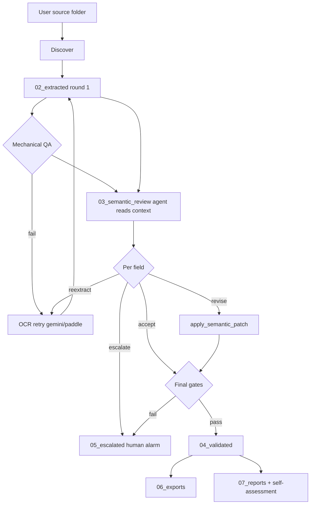

# PharmaDoc Document Intelligence — Full Workflow

## Actors

| Actor | Role |
|-------|------|
| **Staff user** | Provides source folder; answers **only** when agent raises human alarm |
| **Agent** | Orchestrates, **semantic review with common sense**, self-reflection, escalate |
| **PharmaDoc / OCR scripts** | Mechanical extraction, retries, gate scripts |
| **Skill scripts** | Workspace, bundles, audited patches |

## Hybrid pipeline



## Step-by-step (agent checklist)

- [ ] Confirm `SOURCE` and `WORKSPACE` paths
- [ ] `init_workspace.sh <WORKSPACE>`
- [ ] Scan → `00_manifest/inventory.json`
- [ ] Extract round 1 → `02_extracted/*.json` (errors OK)
- [ ] Mechanical QA → `00_manifest/mechanical_qa.json`
- [ ] OCR retry for mechanical failures (max 2 rounds)
- [ ] **For each doc:** `prepare_semantic_review.py` → read bundle
- [ ] **Agent:** write `03_semantic_review/<stem>/review.json`
- [ ] **Agent:** `apply_semantic_patch.py` if revisions (confidence ≥ 0.85)
- [ ] Re-extract if review marks `reextract` (max 2)
- [ ] Sort → `04_validated/` or `05_escalated/` + `human_review_request.json`
- [ ] Export → `06_exports/`
- [ ] Reports → `07_reports/job-summary.md`, `self-assessment.md`
- [ ] Append `logs/reflection.jsonl` + `logs/agent.log`

## Semantic decision tree

```
For each suspicious field:
├─ Matches full_text / cross-field context? → accept
├─ Clear OCR/logic error with evidence? → revise (if confidence ≥ 0.85)
├─ Text illegible in full_text? → reextract
└─ Ambiguous / safety-critical / confidence < 0.85? → escalate (human alarm)
```

## Mechanical retry tree (unchanged)

```
mechanical gate failed?
├─ yes, retry_count < 2
│   ├─ gemini not tried + API key → re-run WITH gemini
│   ├─ scan/handwriting + paddle not tried → PHARMADOC_USE_PADDLE=1
│   └─ else → proceed to semantic review anyway
└─ no → proceed to semantic review
```

## Self-monitoring

After semantic pass, agent must record:
- Revisions applied vs escalated
- Estimated accuracy: mechanical-only vs post-semantic
- Whether handwriting/font issues were resolved without human

See [semantic-review.md](semantic-review.md) and `logs/reflection.jsonl`.
